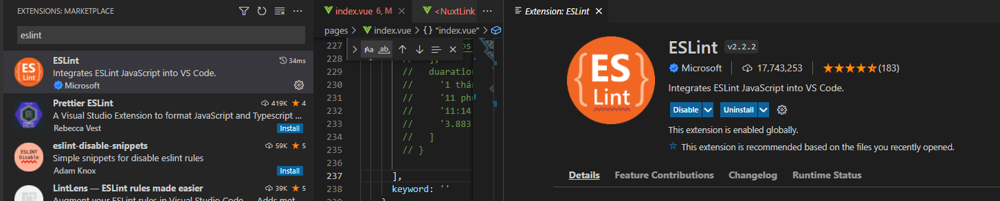
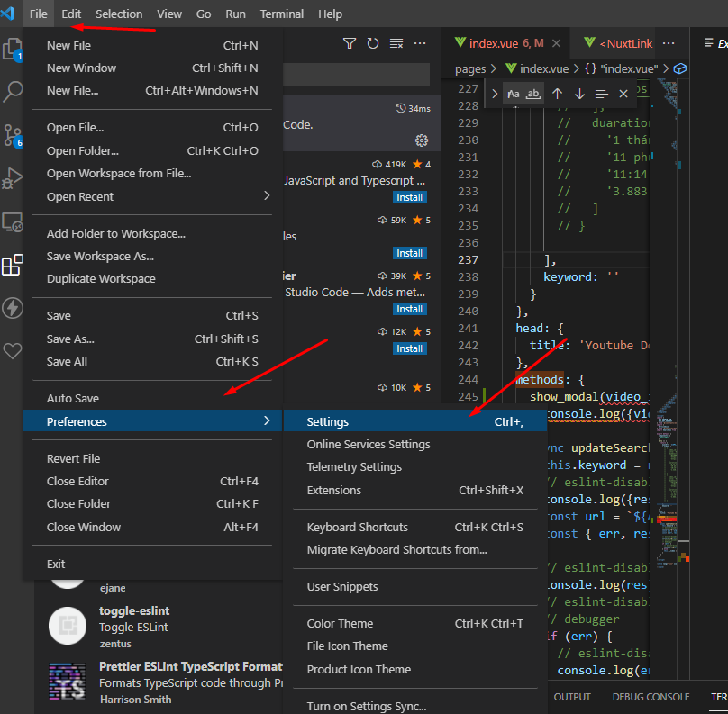
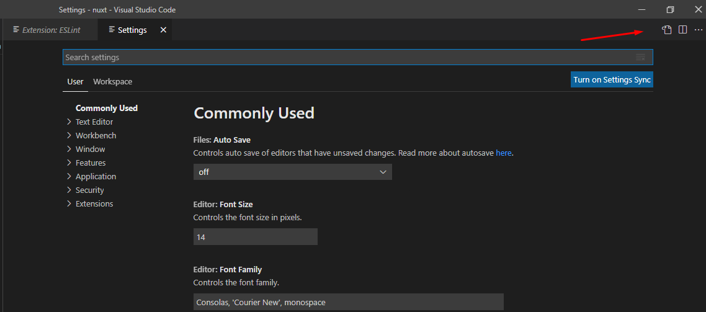
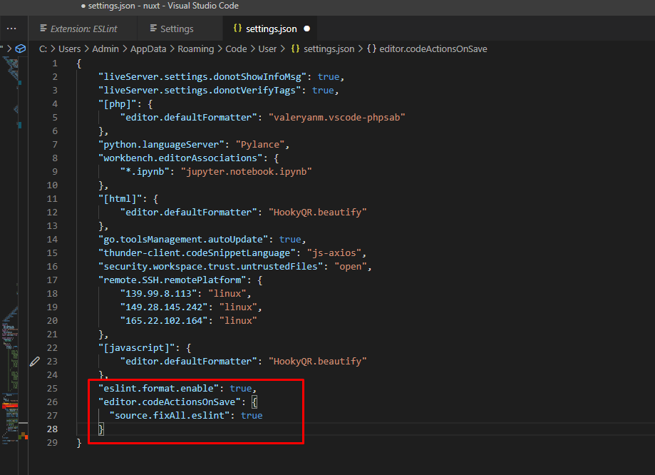
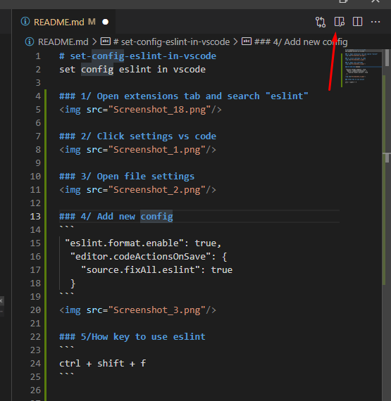

# set-config-eslint-in-vscode
set config eslint in vscode

### 1/ Open extensions tab and search "eslint"


### 2/ Click settings vs code


### 3/ Open file settings


### 4/ Add new config
```
 "eslint.format.enable": true,
  "editor.codeActionsOnSave": {
    "source.fixAll.eslint": true
  }
```


### 5/How key to use eslint
```
ctrl + shift + f
```

